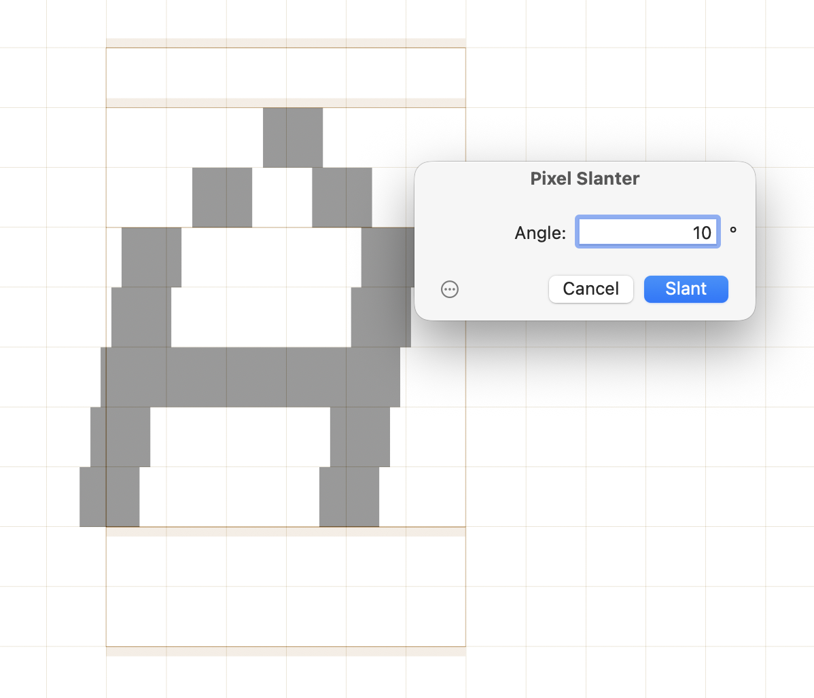

# PixelSlanter

This is a filter for the [Glyphs font editor](https://www.glyphsapp.com/). It pseudo-slants pixel fonts by shifting the components of each glyph into slanted positions, simulating an italic angle without distorting the individual pixel shapes. After installation, it will add the menu item _Filter > Pixel Slanter_.

### Installation

1. In [Glyphs](https://www.glyphsapp.com/), open *Window > Plugin Manager.*
2. Find *Pixel Slanter* and click the *Install* button next to it.
3. Restart Glyphs.

### Usage Instructions

1. Open a glyph in Edit View, or select any number of glyphs in Font or Edit View.
2. Use _Filter > Pixel Slanter_ to bring up the dialog and apply the effect on all selected glyphs.

In the dialog, enter the slant **Angle** in degrees and click *Slant*.

Alternatively, you can also use it as a custom parameter in an instance:

	Property: Filter
	Value: PixelSlanter; angle:<slant angle in degrees>;

If you do not feel like typing it, you can click the _Copy Parameter_ button, which puts the custom parameter with the current dialog settings in the clipboard. You can then paste it into an instance parameter field.

### Requirements

The plugin needs Glyphs 3.0 or higher, running on a recent version of macOS.

### License

Copyright 2026 Rainer Erich Scheichelbauer (@mekkablue).
Based on sample code by Georg Seifert (@schriftgestalt) and Florian Pircher (@florianpircher).

Licensed under the Apache License, Version 2.0 (the "License");
you may not use this file except in compliance with the License.
You may obtain a copy of the License at

http://www.apache.org/licenses/LICENSE-2.0

See the License file included in this repository for further details.
